# Cyberpunk 2077 Theme

A Zed theme extension inspired by Cyberpunk 2077 (Arasaka, Biotechnica, Softsys, NCPD, Kang Tao, Militech, Delamain, Pink neon, Mox).

Each faction ships in two variants — 18 themes in total:

| Variant | Base | Editor | Panels | Tab bar |
| --- | --- | --- | --- | --- |
| `Cyberpunk - <faction>` | One Dark | `#282c33` | `#2f343e` | `#2f343e` |
| `Cyberpunk - <faction> Dark` | One Dark Pro | `#23272e` | `#23272e` | `#1e2227` |

## Previews

In each block the One Dark variant is on the left, the darker One Dark Pro variant on the right.

<!-- previews:start -->

<details open>
<summary><b>Biotechnica</b> &nbsp;<code>#358a74</code></summary>
<p>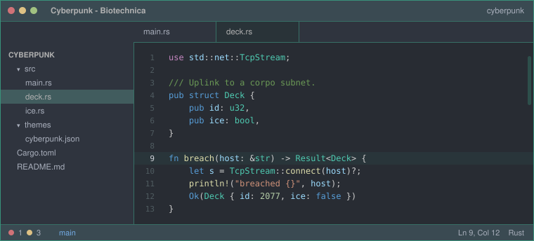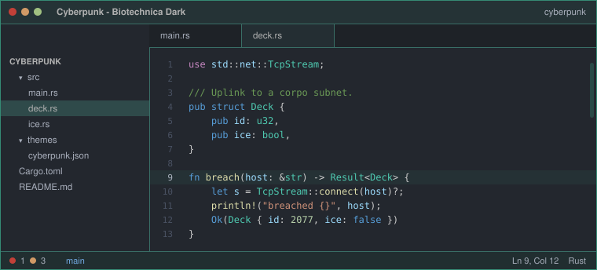</p>
</details>

<details>
<summary><b>Softsys</b> &nbsp;<code>#009090</code></summary>
<p>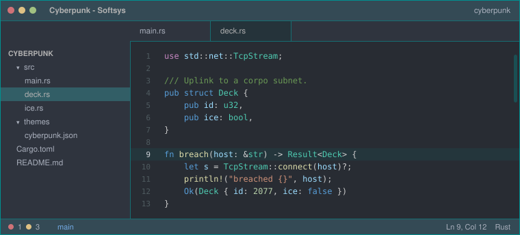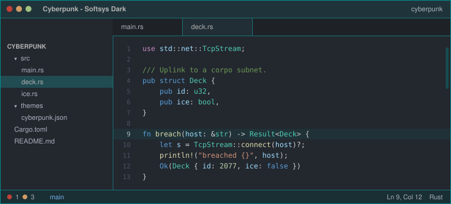</p>
</details>

<details>
<summary><b>Arasaka</b> &nbsp;<code>#cc0000</code></summary>
<p>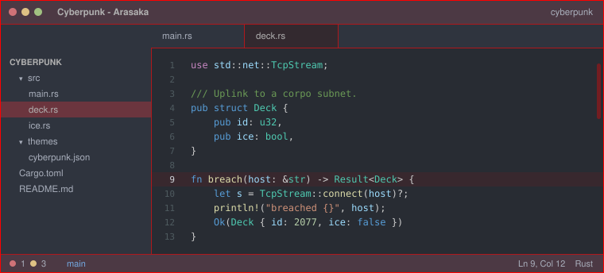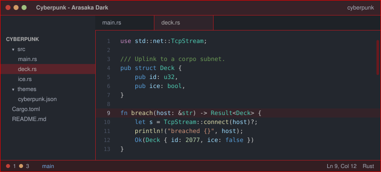</p>
</details>

<details>
<summary><b>Militech</b> &nbsp;<code>#e6d709</code></summary>
<p>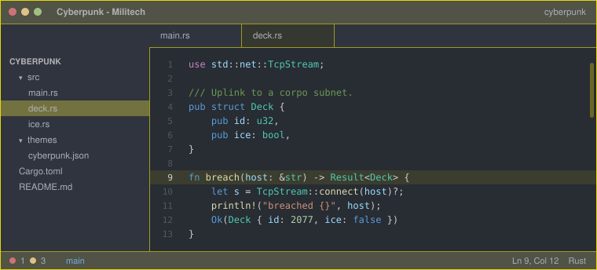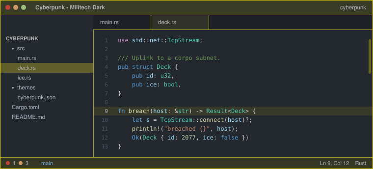</p>
</details>

<details>
<summary><b>Kang tao</b> &nbsp;<code>#e16b27</code></summary>
<p>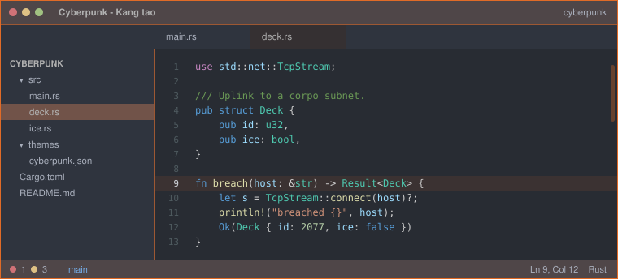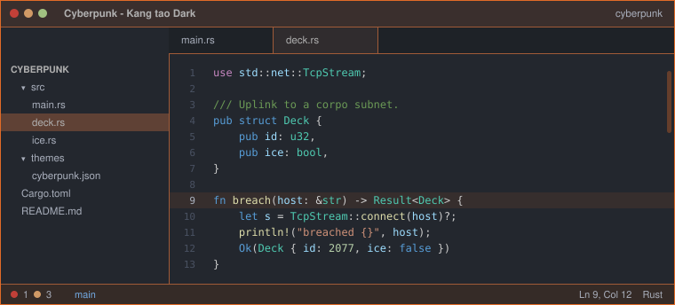</p>
</details>

<details>
<summary><b>NCPD</b> &nbsp;<code>#445e88</code></summary>
<p>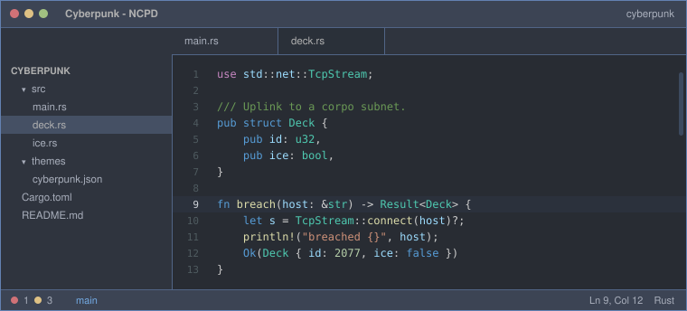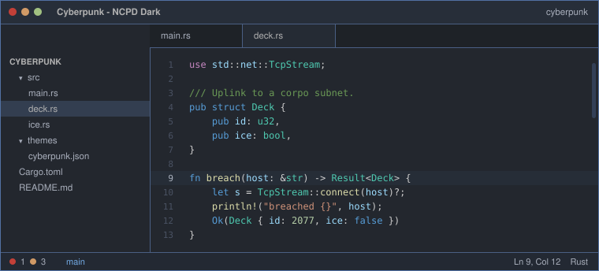</p>
</details>

<details>
<summary><b>Delamain</b> &nbsp;<code>#a0a0a0</code></summary>
<p>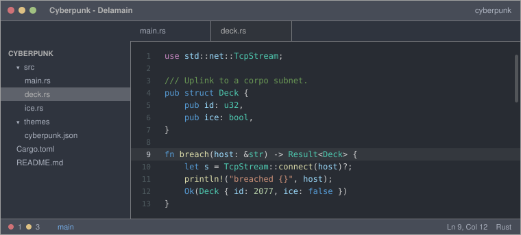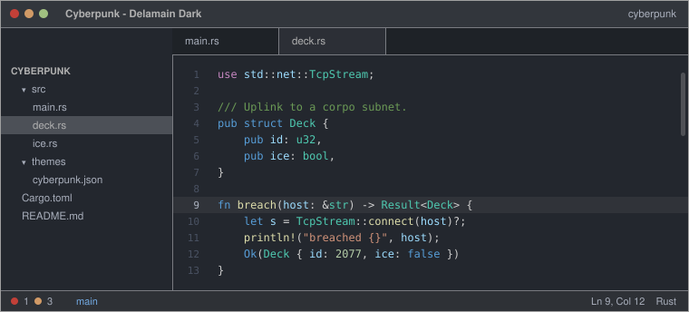</p>
</details>

<details>
<summary><b>Pink neon</b> &nbsp;<code>#c871af</code></summary>
<p>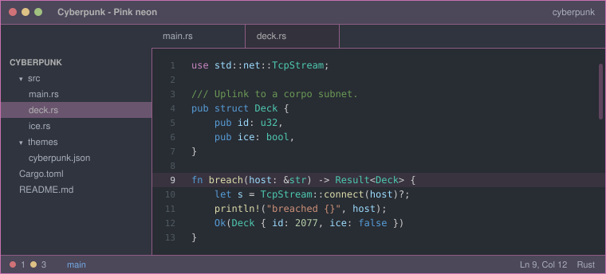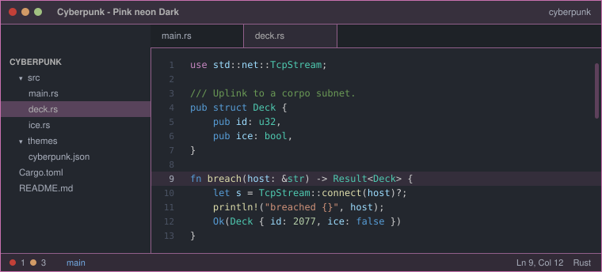</p>
</details>

<details>
<summary><b>Mox</b> &nbsp;<code>#9b59d0</code></summary>
<p>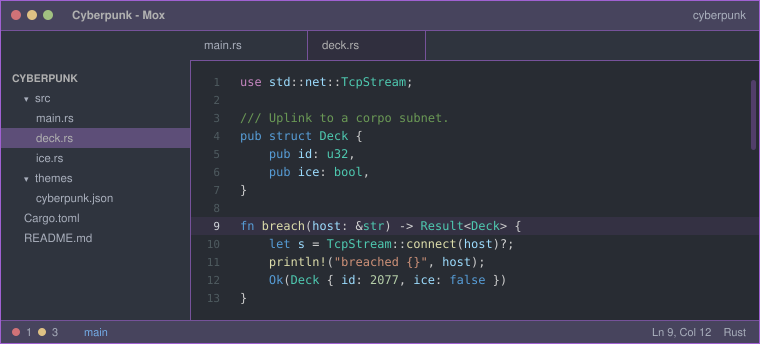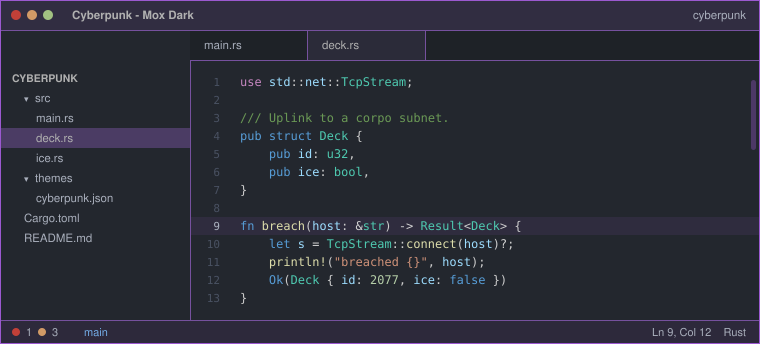</p>
</details>

<!-- previews:end -->

## Design

- **Panels, buttons, tabs, surfaces, terminal and diagnostics** come from One Dark (built into Zed) or One Dark Pro, so nothing sits on pure black. Where One Dark Pro leaves a key unset, One Dark's value is used.
- **The faction accent** carries the identity: borders, focus rings, cursor, selection, active line, active tab, scrollbar, and a faint tint on the title bar and status bar. Dark accents such as Arasaka's red are lightened just enough to stay legible against the grey, hue and saturation preserved.
- **Syntax** is the theme's own VS Code Dark+ palette, unchanged.

## Install locally in Zed

1. Open the command palette.
2. Run `zed: install dev extension`.
3. Select this directory.
4. Choose one of the themes starting with `Cyberpunk - ` in Zed appearance settings.

## Editing the themes

`themes/cyberpunk.json` and the previews in `assets/` are generated. Edit `scripts/generate_themes.py`, then run both scripts:

```sh
python3 scripts/generate_themes.py    # themes/cyberpunk.json
python3 scripts/generate_previews.py  # assets/*.svg + the Previews section above
```

`generate_previews.py` draws a mock Zed window per theme straight from the theme JSON, so the previews cannot drift from the colours. It also rewrites the gallery between the `<!-- previews:start -->` / `<!-- previews:end -->` markers in this file.

Faction accents live in `FACTIONS`, the two base palettes in `ONE_DARK` and `ONE_DARK_PRO`, and the tunables at the top of the file control how strongly the accent shows through (`BORDER_MIX`, `CHROME_TINT`, `TAB_TINT`, `ACTIVE_LINE_TINT`).

## Notes

- Repository: `https://github.com/thomassimmer/cyberpunk-2077-zed-extension`
- The extension id already uses the recommended `-theme` suffix for Zed theme extensions.
